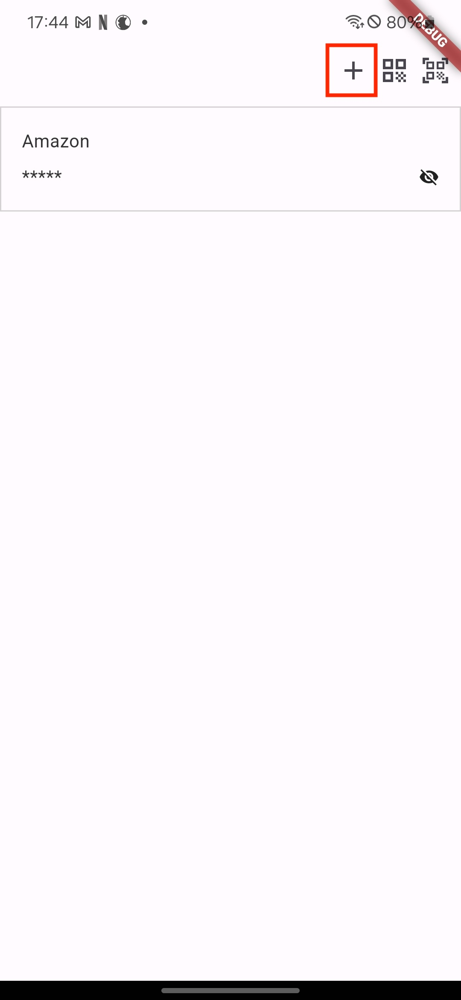
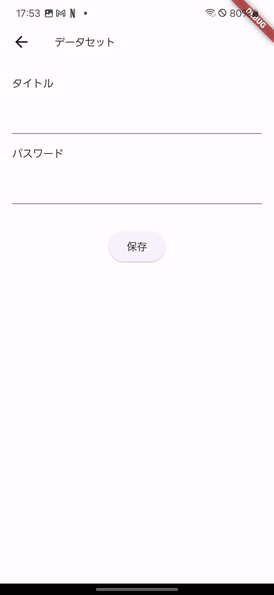
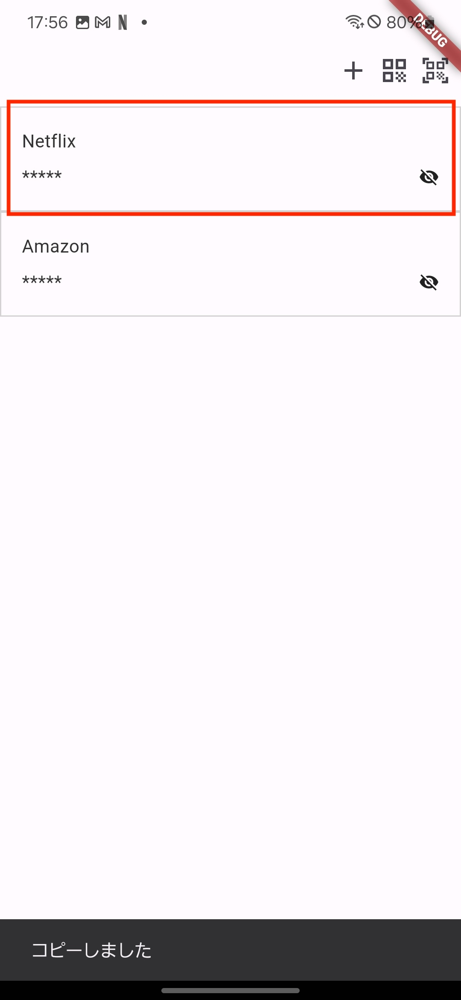
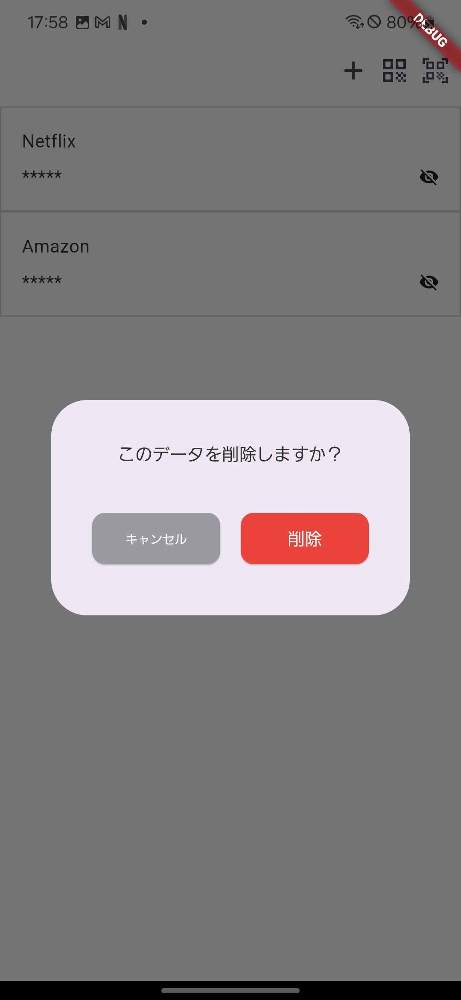
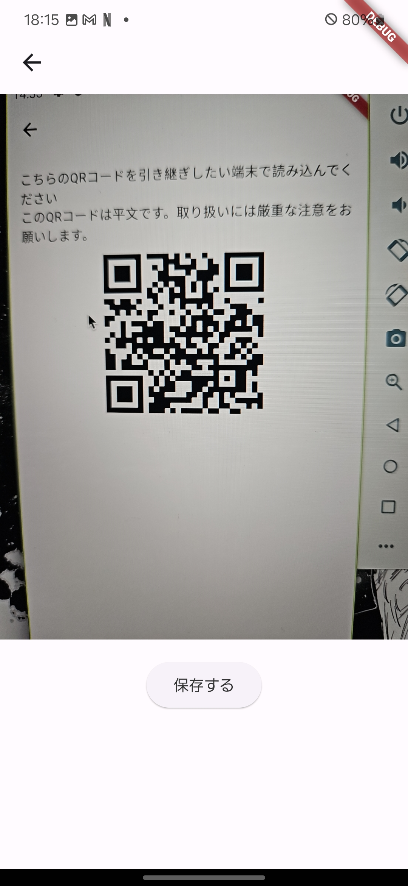
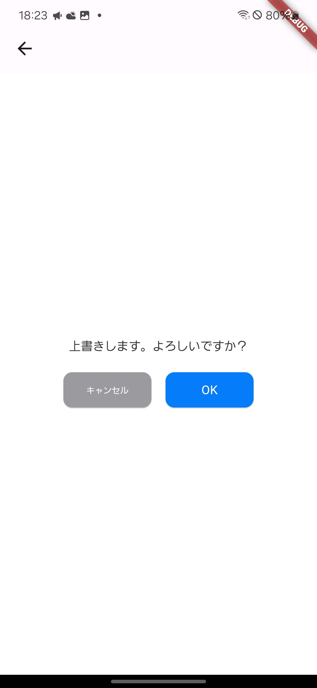

# pass_manager

パスワード等を管理できるアプリです 
データの引き継ぎはQRコードを読み込むことで簡単に引き継ぎできます！

# 開発環境

Flutter ver3.19.5 
Dart ver3.3.3

# 起動方法

fvm flutter run -d {デバイスID}

# 利用方法

## データの追加

プラスのアイコンから、データの追加画面に遷移できます。

データを入力したら「保存」を押してください。

## パスワードのコピー

データの一覧画面から、任意のデータをタップすることでパスワードのコピーが行えます。

長押しで削除できます

## データの引き継ぎ方法

データを登録している端末でQRを表示します。

このようにQRが表示されます。

### QRを読み込む

一番右のアイコンを押すと、カメラが起動します。

QRが読み込まれると「保存」ボタンが表示されます。 
保存を押すと上書きするかどうか確認画面が表示されます。

上書きした場合はQRを読み込んだ側の端末データは全て削除されます。
